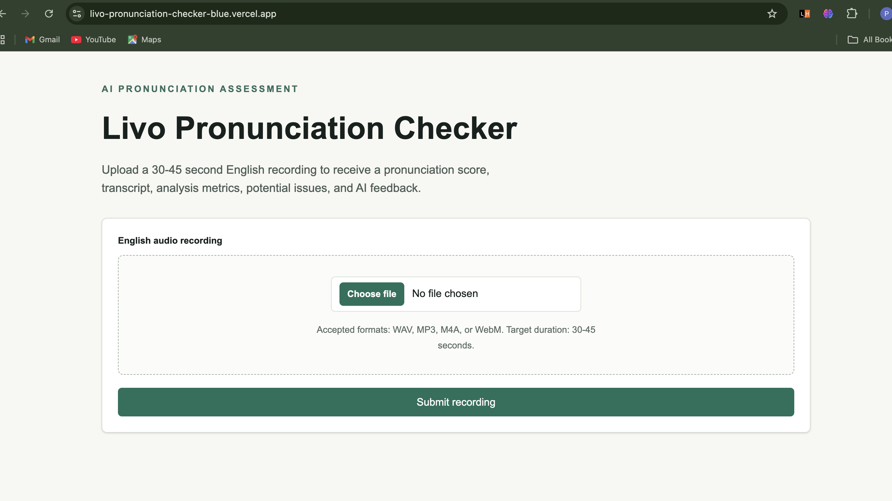
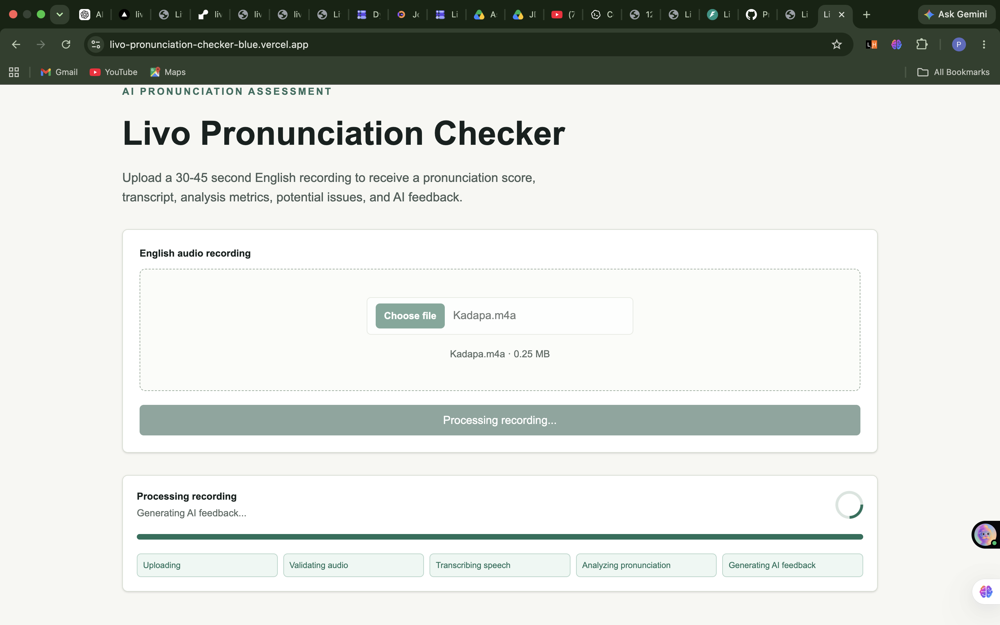
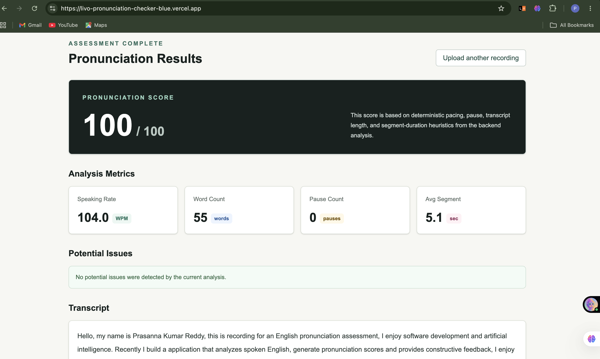
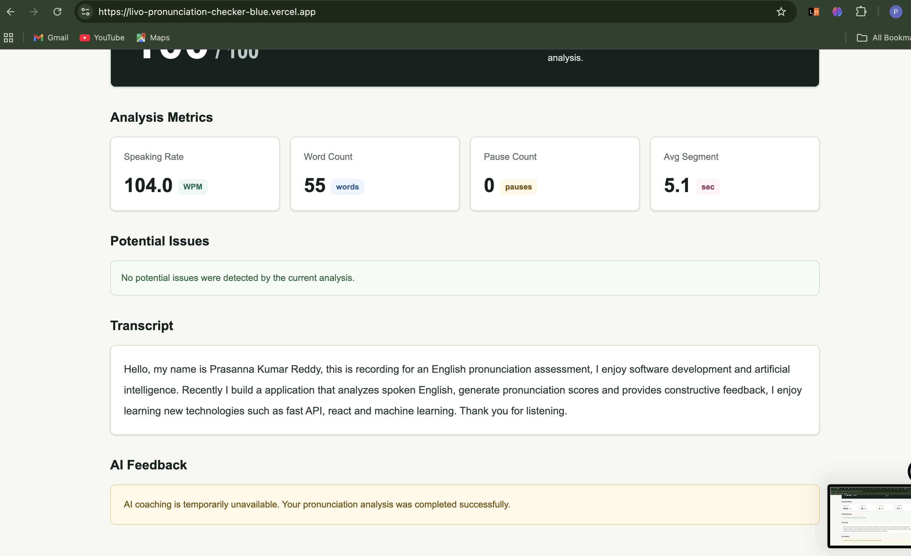

# 🎙️ AI English Pronunciation Assessment

A production-ready web application for evaluating spoken English pronunciation from a **30–45 second English audio recording**.

The application validates uploaded audio, generates a speech transcript, computes pronunciation-related speaking metrics, identifies potential fluency issues, and optionally generates AI-assisted coaching feedback.

This project was developed as part of the **Livo AI Software Engineer Assessment**.

---

# 🚀 Live Demo

### Frontend

👉 https://livo-pronunciation-checker-blue.vercel.app

### Backend Health

👉 https://livo-pronunciation-checker-api.onrender.com/health

---
# 📸 Screenshots

## Upload Page



---

## Processing



---

## Results




# ✨ Features

- 🎤 Upload 30–45 second English audio recordings
- ✅ Audio validation (duration, format, and file size)
- 📝 Speech transcription using Faster-Whisper
- 📊 Deterministic pronunciation analysis
- 🔎 Pronunciation Highlights from transcript segment timing
- 📈 Speaking rate analysis
- ⏸️ Pause detection
- 📄 Transcript generation
- 🤖 Optional AI-generated coaching feedback
- ⚠️ Pronunciation and fluency issue detection
- 📱 Responsive modern UI
- 🛡️ Graceful fallback when AI feedback is unavailable

---
# 🔄 Application Workflow

1. User uploads a 30–45 second English audio recording.
2. Backend validates duration, format, and file size.
3. Faster-Whisper transcribes the speech.
4. Pronunciation metrics are computed deterministically.
5. Segment-level Pronunciation Highlights are generated.
6. Optional AI coaching feedback is generated.
7. Results are returned to the frontend and displayed.

---

# 🛠 Tech Stack

## Frontend

- Next.js (App Router)
- TypeScript
- Tailwind CSS

## Backend

- FastAPI
- Python 3.11
- Faster-Whisper
- Mutagen
- Pydantic
- OpenAI Chat Completions API (optional)

## Deployment

- Frontend: Vercel
- Backend: Render

---

# 📁 Project Structure

```text
.
├── frontend/      # Next.js frontend
├── backend/       # FastAPI backend
└── docs/          # Architecture & deployment documentation
```

---

# 🏗 System Architecture

```text
Browser
   │
   ▼
Next.js Frontend (Vercel)
   │
REST API
   │
   ▼
FastAPI Backend (Render)
   │
   ▼
Upload Validation
   │
   ▼
Audio Duration Validation
   │
   ▼
Faster-Whisper Transcription
   │
   ▼
Pronunciation Analysis
   │
   ├────────► Pronunciation Highlights
   │
   └────────► Optional AI Feedback
   │
   ▼
JSON Response
   │
   ▼
Results Dashboard
```

---

# 🔎 Pronunciation Highlights

Pronunciation Highlights are deterministic heuristic observations derived only from
data already produced by the application:

- transcript segmentation
- segment speaking rate
- pause duration between segments
- segment timing

They are **not** phoneme-level pronunciation judgments. The application does not
make unsupported word-level pronunciation error claims.

---

# ⚙️ Local Setup

## Prerequisites

- Node.js 20+
- Python 3.11+
- npm

---

## Backend

```bash
cd backend

python3.11 -m venv .venv

source .venv/bin/activate

pip install -r requirements.txt

cp .env.example .env

uvicorn app.main:app --reload
```

Backend:

```
http://localhost:8000
```

> The first transcription request may download the configured Faster-Whisper model if it is not already cached.

---

## Frontend

```bash
cd frontend

npm install

cp .env.example .env.local

npm run dev
```

Frontend:

```
http://localhost:3000
```

---

# 🔑 Environment Variables

## Backend

```env
APP_ENV=development
BACKEND_CORS_ORIGINS=http://localhost:3000,http://127.0.0.1:3000
MAX_UPLOAD_SIZE_MB=25
UPLOAD_DIR=/tmp/livo-pronunciation-checker/uploads

TRANSCRIPTION_MODEL_SIZE=base
TRANSCRIPTION_DEVICE=cpu
TRANSCRIPTION_COMPUTE_TYPE=int8

OPENAI_API_KEY=
OPENAI_MODEL=gpt-4o-mini
```

## Frontend

```env
NEXT_PUBLIC_API_BASE_URL=http://localhost:8000
```

---

# 📡 API

## POST

```
/api/v1/assessments
```

### Supported Formats

- WAV
- MP3
- M4A
- WebM

### Response

Returns a JSON response containing:


- Upload metadata
- Speech transcript
- Pronunciation score
- Speaking metrics
- Potential issues
- Pronunciation Highlights
- Optional AI coaching feedback

---

# 🧪 Running Tests

## Backend

```bash
cd backend

pytest

ruff format --check app tests

ruff check app tests
```

## Frontend

```bash
cd frontend

npm run lint

npm run typecheck

npm run build
```

---

# 🚀 Deployment

| Service | Platform |
|---------|----------|
| Frontend | Vercel |
| Backend | Render |

Deployment instructions are available in:

```
docs/deployment.md
```
Note: The backend is deployed on Render's free tier. The first request after inactivity may take longer due to cold starts.

---

# 🔮 Future Improvements

- 🎯 Word-level pronunciation scoring
- 🗣️ Phoneme alignment for fine-grained pronunciation assessment
- 🔍 WhisperX / forced alignment integration for more accurate timing
- 📊 Confidence-based pronunciation scoring
- 🎤 Real-time microphone recording
- ⚡ Streaming transcription and live feedback
- 📈 Audio waveform and speech visualization
- 👤 User authentication
- 📚 Assessment history and progress tracking
- 💾 Persistent storage for user assessments
- 📦 Batch audio assessment for multiple recordings
---

# 📄 License

This project was developed as part of the **Livo AI Software Engineer Assessment** and is provided for demonstration and educational purposes.
